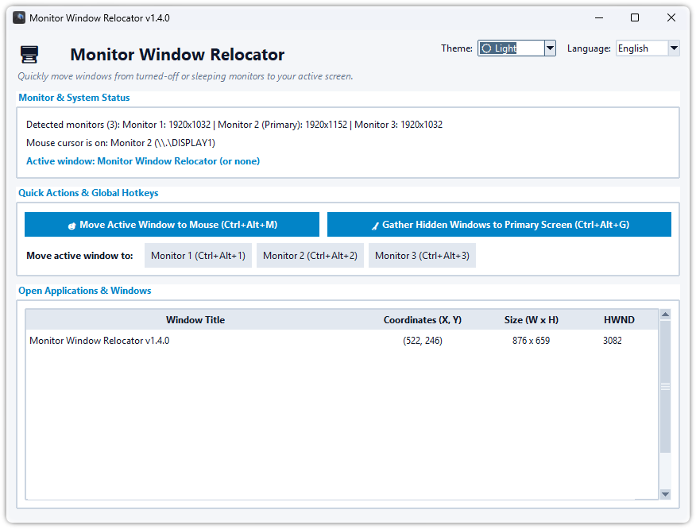

# 🖥️ Monitor Window Relocator

[](VERSION)
[](https://www.python.org/downloads/)
[](https://www.microsoft.com/windows)
[](LICENSE)
[](#-language-support--wsparcie-językowe)
[](#-dark-theme--ciemny-motyw)

**Monitor Window Relocator** is a lightweight Windows utility that solves the multi-monitor problem where application windows open off-screen on powered-off, sleeping, or disconnected monitors (e.g., in 3-monitor setups).

It allows you to instantly pull any hidden or stranded window back to your active display using global hotkeys, a graphical user interface (GUI), or command-line execution scripts.

<p align="center">
  
</p>

---

## 🚀 Key Features

- **🌙 Dark Theme & System Theme Integration**: Modern high-contrast dark theme, automatic Windows dark mode detection, and dynamic in-app theme switcher.
- **🎨 Windows Immersive Dark Titlebar**: Uses Desktop Window Manager (DWM) Win32 API to render dark title bars natively on Windows 10 & 11.
- **🖼️ Multi-Resolution Icon**: High-resolution branding icon with multi-layer Windows ICO packaging (16px to 256px).
- **Instant Off-Screen Window Recovery**: Automatically scan all running windows and relocate any hidden/stranded windows to your primary monitor.
- **Move to Mouse Cursor**: Bring the active application window straight to whichever monitor your mouse cursor is currently resting on.
- **Direct Monitor Selection**: Move windows directly to Monitor 1, 2, or 3 using single key shortcuts.
- **Global Hotkeys**: Control window positions anytime in the background without focusing the application.
- **Multilingual Support**: Fully localized in **English** (default) and **Polish** with dynamic in-app language switching.
- **Zero External Dependencies**: Built strictly using the Python Standard Library (`ctypes`, `tkinter`). No `pip install` required to run from source!
- **📦 Standalone Executable & GitHub Releases**: Easy single-file executable build (`build_exe.py`) and automated GitHub Actions release deployment.
- **High-DPI Aware**: Fully compatible with Windows 10/11 per-monitor DPI scaling setups.

---

## 🌙 Dark Theme / Ciemny Motyw

The application provides full support for Dark and Light themes:
- **System Default (Domyślny systemowy)**: Automatically detects whether Windows is in Dark Mode or Light Mode.
- **Dark Theme (Ciemny motyw)**: Sleek, high-contrast dark palette tailored for low-light environments.
- **Light Theme (Jasny motyw)**: Clean, high-readability light palette.
- Switch themes anytime using the **Theme dropdown** in the header or via the top menu (`Theme` / `Motyw`). Your preference is automatically saved to `config.json`.

---

## ⌨️ Global Hotkeys

The application runs in the background and responds to system-wide hotkeys:

| Hotkey | Action |
| :--- | :--- |
| **`Ctrl + Alt + M`** | **Move active window** to the monitor under the mouse cursor. |
| **`Ctrl + Alt + G`** | **Gather all hidden / off-screen windows** back to the Primary Monitor. |
| **`Ctrl + Alt + 1`** | Move active window to **Monitor 1**. |
| **`Ctrl + Alt + 2`** | Move active window to **Monitor 2**. |
| **`Ctrl + Alt + 3`** | Move active window to **Monitor 3**. |

---

## 🛠️ Usage & Execution

### Option A: Standalone Executable (.exe)
Download the latest pre-compiled `MonitorWindowRelocator.exe` from [GitHub Releases](https://github.com/P3rgam0n/MonitorWindowRelocator/releases) and run it directly without installing Python.

---

### Option B: Running from Source

#### Prerequisites
- Operating System: **Windows 10 / 11**
- Python Environment: **Python 3.8+** (standard library Tkinter included)

#### 1. Running the GUI Application
Launch the graphical interface with full display status and open applications list:
- Double-click `Run_App.bat`
- Or execute via terminal:
  ```cmd
  python main.py
  ```

#### 2. Standalone Quick Gather (No GUI)
Gather off-screen windows instantly via command line or background script:
- Double-click `Gather_Offscreen_Windows.bat`
- Or execute via terminal:
  ```cmd
  python main.py --gather
  ```

---

### 3. Command Line Arguments

| Argument | Description |
| :--- | :--- |
| `--gather` | Scans and moves all off-screen windows to the primary display and exits. |
| `--to-cursor` | Moves the currently active foreground window to the mouse display and exits. |
| `--mon <N>` | Moves the active foreground window to Monitor N (e.g. 1, 2, 3...) and exits. |
| `--lang <en\|pl>` | Forces startup in the specified language (`en` for English, `pl` for Polish). |
| `--theme <system\|dark\|light>` | Forces interface theme (`system`, `dark`, `light`). |
| `--version`, `-v` | Displays version information. |
| `--help`, `-h` | Displays help message and exits. |

---

## 🔨 Building the Standalone Executable

To compile a standalone, single-file Windows binary:
1. Install build dependencies:
   ```cmd
   pip install pyinstaller pillow
   ```
2. Run the build script:
   ```cmd
   python build_exe.py
   ```
3. The resulting binary `MonitorWindowRelocator.exe` and distribution package `MonitorWindowRelocator-v1.2.0-windows-x64.zip` will be generated in the `dist/` directory.

---

## 🧪 Testing & Verification

Run the built-in automated test suite with Python's standard unittest runner:
```cmd
python -m unittest test_relocator.py -v
```

---

## 🌐 Language Support / Wsparcie Językowe

The interface automatically detects your Windows system display language (**English** or **Polish**), and can also be switched dynamically at any time:
1. Use the **Language dropdown** in the top-right corner of the window.
2. Or choose `Language -> Polski / English` from the top menu bar.
3. Your preference is automatically saved to `config.json` for future launches.

---

## 📁 Repository Structure

```
MonitorWindowRelocator/
├── .github/
│   └── workflows/
│       └── build-release.yml    # GitHub Actions workflow for automated releases
├── assets/
│   ├── icon.ico                 # Multi-resolution Windows icon (16px to 256px)
│   ├── icon.png                 # High-resolution application branding PNG
│   └── MonitorWindowRelocator_Icon.png # Master asset
├── main.py                      # Complete application (Core, Win32 API, Hotkeys, i18n, Theme Engine, GUI & CLI)
├── test_relocator.py            # Automated unit & integration test suite (46 tests)
├── build_exe.py                 # PyInstaller standalone build script
├── VERSION                      # Semantic version number
├── CHANGELOG.md                 # Release history and changelog
├── Run_App.bat                  # Background launcher script for GUI
├── Gather_Offscreen_Windows.bat # Instant CLI script to gather hidden windows
├── MonitorWindowRelocator.png   # Application interface screenshot
├── LICENSE                      # MIT Open Source License
├── .gitignore                   # Git ignore rules (binaries, caches, local configs)
└── README.md                    # Project documentation
```

---

## 📄 License

This project is licensed under the MIT License - see the [LICENSE](LICENSE) file for details.
